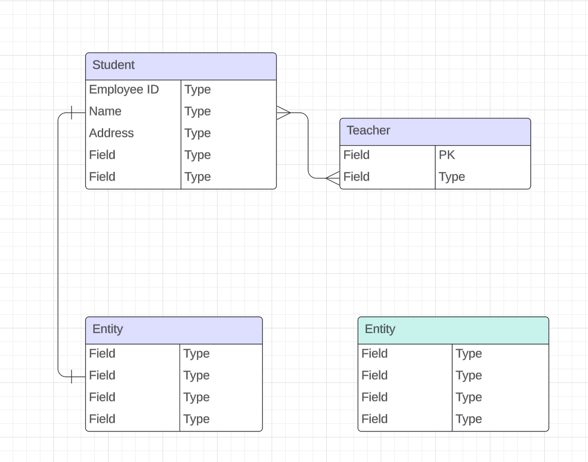

# Pokemon Showdown Teams Builder

This is a Full Stack Web App made in .NET to help users build and persist their Pokemon teams to a backend. 

## Project Members
- Kung Lo

## Project Requirements
- Application must build and run.
- Unit Testing (70% code coverage for Services and Models layer)
- Utilize an external API (https://pokeapi.co/)
- Backend hosted on Azure Cloud Service

## Tech Stack

- React/JS (Front End)
- C# (Back End Programming Language)
- SQL Server (Azure Hosted)
- EF Core (ORM Tech)
- ASP.NET (Web API Framework)
- HTML, CSS
    - Bootstrap? Tailwind? 

## User Stories
- User should be able to login/logout if they already have an account
- User should be able to register if they do not have an account
- User should be able to create a new showdown team
- User should be able to choose up to six Pokemon
- User should be able to customize stat totals, levels, move sets and held items for each Pokemon
- User should be able view all previous teams that they created
- User should be able to delete teams that they don’t need
- User should be able to have all data needed to import their team to Pokemon Showdown

## Tables

## MVP Goals
- Trainer(s) can create a new team with up to six pokemon
- Trainer(s) can view previous teams that they created
- Trainer(s) can delete team(s)
- Trainer(s) can view previous teams even if all cache data is cleared or a new browser instance is created on a different machine
- Trainer teams are fully customizable:
- EV and IV spreads, abilities, move sets, held items etc.
- Exportable data(via string) to transfer team information to Pokemon Showdown

## Stretch Goals
- Implement login/logout and register functionality to allow for multiple users
- User authentication and password encryption
- Login using google, facebook account
- Possibly implement Dockersize for packaging application